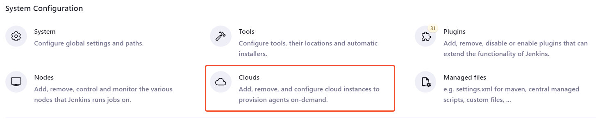

# Keycloak Backups Implementation Steps

## Pre-requisites

### 1. Create Jenkins Credential: kubeconfig

#### 1.1. (optional) Create Service Account, Role and RoleBinding for Keycloak Backup cluster access

- [ ] Follow the [how-to-create-sa-and-kubeconfig.md](./how-to-create-sa-and-kubeconfig.md) documentation

### 2. Install Jenkins Kubernetes Plugin

- official documentation: <https://plugins.jenkins.io/kubernetes/>
- [ ] Install the `Kubernetes plugin` to Jenkins

#### 2.1. Create `Cloud` for Jenkins Kubernetes Plugin

`Cloud` is the Kubernetes cluster that Jenkins will use to run the Keycloak backup job.

- [ ] Go to `Manage Jenkins > Clouds`
- 
- [ ] Create a new Cloud for your K8s Cluster
  - [ ] Select Kubernetes
  - [ ] Use existing kubeconfig credential
  - 

## Implementation Steps

### 1. Add `KeycloakBackupAndUploadToS3.groovy` to your Jenkins Shared Library

- [ ] Copy over the `KeycloakBackupAndUploadToS3.groovy` file to your Jenkins Shared Library `vars/` directory

### 3. Create Jenkins Pipeline Job

#### 3.1. Get metadata from running Keycloak on K8s

| Parameter Name                      | About                                                                                                   |
| ----------------------------------- | ------------------------------------------------------------------------------------------------------- |
| kubeconfig_credentials_id           | **(required)** Jenkins Credentials ID for the kubeconfig                                                |
| cluster_name                        | **(required)** Cluster Name (used in the S3 backup folder hierarchy)                                    |
| label_app_kubernetes_io_instance    | **(required)** Keycloak `app.kubernetes.io=` label value on the Keycloak pods                           |
| keycloak_namespace                  | **(required)** Namespace of the keycloak instance                                                       |
| aws_access_key_id_credential_id     | **(required)** Jenkins Credentials ID for `AWS_ACCESS_KEY_ID`                                           |
| aws_secret_access_key_credential_id | **(required)** Jenkins Credentials ID for `AWS_SECRET_ACCESS_KEY`                                       |
| s3_bucket_name                      | **(required)** S3 Bucket Name for backups                                                               |
| aws_endpoint_url_s3                 | **(optional, default: `https://s3.amazonaws.com`)** S3 Endpoint URL. Keep it empty to use AWS normally. |
| k8s_plugin_cloud_name               | **(required)** Manage Jenkins > Clouds -> Name of the cluster                                           |

#### 3.2. Create a Jenkinsfile on your repository

- [ ] Create a Jenkinsfile from the template
- [ ] Copy the [Template Jenkinsfile](../jenkins-job/Jenkinsfile.template) to your Jenkins cicd repo 
- [ ] Fill in your parameter values

#### 3.3. Create a Jenkins Pipeline Job

- [ ] Go to appropriate Jenkins folder
- [ ] Go to `New Item` > `Pipeline`
- [ ] Configure the pipeline
  - [ ] Select `Pipeline script from SCM`
  - [ ] Add the repository URL
  - [ ] Add the Jenkinsfile path

#### 3.4. Run the pipeline
- [ ] Test the pipeline
